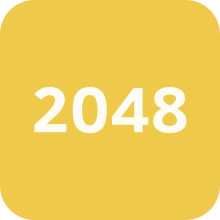

# 2048
Game 2048

The modules in the requirements.txt file are installed by issuing the following command in the terminal.

<pre>pip install -r requirements.txt</pre>

The remaining modules are standard python modules. Run the main.py file to run the game.

Use the pyinstaller module to convert the game to .exe format. And run the following command in the terminal :

<pre>pyinstaller main.py --onefile -w</pre>

You can perform the following modifications to perform additional customization work in the game.

<code>self.__size</code> - creating an <code>NxN</code> board. The minimum value of <code>N</code> should be 4.

<code>self.__dict_color</code> - list of colors used in numbers. You can change it with your favorite colors.

Colors used in numbers :

<code>#cdc1b5</code> - 0
 
<code>#eee4da</code> - 2

<code>#ece0c8</code> - 4

<code>#f8ba05</code> - 8

<code>#fb9b00</code> - 16

<code>#fe5404</code> - 32

<code>#fc290c</code> - 64

<code>#a9174b</code> - 128

<code>#8701b1</code> - 256

<code>#158dc7</code> - 512

<code>#0844fc</code> - 1024

<code>#67b131</code> - 2048

<code>#d2e929</code> - 4096

Leave a comment if you have ideas for additional colors. For numbers after 4096.

